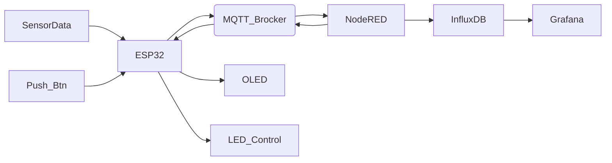

# esp_mini_weatherstation
Smart ESP32-based weather station with OLED display, MQTT communication, and Node-RED integration.

# 🌐 XminD – IoT Weather Station

A smart IoT weather station built with **ESP32**, capable of collecting environmental data and publishing it via **MQTT** to **Node-RED**, storing data in **InfluxDB**, and visualizing it in **Grafana**. Data is also shown locally on an **OLED display** with multi-page interface using a push-button. The project is fully open-source and educational.

## 🚀 Features
- 📡 MQTT communication with Node-RED
- 🌡️ Sensors: Temperature (DHT11), Humidity, Altitude(Simulated), Light Intensity (BH1750)
- 🖥️ OLED screen with multi-page navigation (via button)
- 💡 LED control via MQTT + on-screen lamp icon for status
- 🧠 Data logging in **InfluxDB**
- 📊 Real-time dashboards with **Grafana**
- 🔁 Clean and modular codebase (Arduino-compatible)
- 🛠️ Designed for education and real-world IoT use cases

## 📦 Technologies Used
- ESP32 (Arduino Framework)
- DHT11, BH1750 Sensors
- SSD1306 OLED Display (Adafruit GFX)
- MQTT (e.g. Mosquitto/EMQX)
- Node-RED (Flow-based interface)
- InfluxDB (Time-series DB)
- Grafana (Real-time visualization)

## 🖼️ Project Screenshots
> 📸
[Grafana Dashboard](images/Grafana_Dashboard.png)
> [InfluxDB Data Explorer](images/InfluxDB_Data_Explorer.png)
> [Node-RED Flow](images/Mini_WeatherStation_NodeRED_Flow.png)
> [Containers List](images/Containers_List.png)
> [Prototype](images/Prototype.jpg)

---

## 🧠 System Overview

---

## 🛠️ Deployment Notes

**Docker** is used (via WSL) to install and run containers in this project.  
The MQTT broker used is **EMQX**, enabling efficient and scalable messaging.

---

## 📲 Follow Us
- Instagram: [@x_mindworld](https://instagram.com/x_mindworld)
- Telegram: [t.me/x_mindworld](https://t.me/x_mindworld)

---

# 🌍 ایستگاه آب‌و‌هوای هوشمند با ESP32

این پروژه یک ایستگاه آب‌و‌هوای اینترنت اشیا (IoT) مبتنی بر **ESP32** است که داده‌های محیطی (دما، رطوبت، نور، ارتفاع) را جمع‌آوری کرده و از طریق **MQTT** به **Node-RED** ارسال می‌کند. اطلاعات به‌صورت محلی در صفحه **OLED** با رابط چندصفحه‌ای نمایش داده می‌شود. همچنین داده‌ها در **InfluxDB** ذخیره شده و از طریق **Grafana** به‌صورت زنده نمایش داده می‌شود.

## 🎯 قابلیت‌ها
- ارتباط MQTT با Node-RED
- سنسورها: دما، رطوبت، شدت نور، ارتفاع(شبیه سازی شده)
- نمایشگر OLED با صفحات مختلف و کنترل با دکمه
- کنترل LED از طریق MQTT + نمایش وضعیت با آیکون
- ذخیره‌سازی داده‌ها در InfluxDB
- داشبورد گرافیکی با Grafana
- ساختار کد تمیز و قابل استفاده برای آموزش

## 📚 تکنولوژی‌ها:
- برد ESP32
- سنسورهای DHT11 و BH1750
- نمایشگر OLED (SSD1306)
- MQTT Brocker (مثل Mosquitto/EMQX)
- Node-RED
- InfluxDB (دیتابیس سری زمانی)
- Grafana برای نمایش گرافیکی اطلاعات

---

## 🛠️ نکات استقرار

در این پروژه از **Docker** (بر بستر WSL) برای نصب و اجرای کانتینرها استفاده شده است.  
بروکر مورد استفاده برای ارتباط MQTT، بروکر **EMQX** است که پیام‌رسانی سریع و مقیاس‌پذیر را فراهم می‌کند.

---

## ✨ پشتیبانی و دنبال‌کردن
- اینستاگرام: [@x_mindworld](https://instagram.com/x_mindworld)
- تلگرام: [t.me/x_mindworld](https://t.me/x_mindworld)

> اگر این پروژه برات مفید بود، خوشحال می‌شیم با دادن ⭐️ به این مخزن از ما حمایت کنی!

